<h1 align="center">parsi-lint</h1>

<p align="center">
  باگ‌هایی از متن فارسی را می‌گیرد که آن را ماشینی نشان می‌دهند، سرچ را می‌شکنند، یا خراب منتشر می‌شوند. پیش از انتشار، نه بعدش.
</p>

<p align="center">
  <a href="https://github.com/ssepehrnoush/parsi-lint/actions/workflows/ci.yml"></a>
  
  = 18" src="https://img.shields.io/badge/node-%3E%3D18-brightgreen">
  
  
</p>

<p align="center">
  
</p>

<p align="center"><a href="README.md">English</a></p>

<div dir="rtl">

بدون هیچ وابستگی. در CI اجرا می‌شود. هر چه را که امن باشد خودش درست می‌کند.

</div>

```bash
npx github:ssepehrnoush/parsi-lint content/
```

<div dir="rtl">

## چرا ساخته شد

ابزارهای موجودِ متن فارسی نرمالایزرند: متن می‌دهی، متنِ تمیزشده می‌گیری. این شکل برای یک خط تولید محتوا غلط است. تو نمی‌خواهی یک اسکریپت بی‌صدا مقالهٔ پزشکی‌ات را سرِ راهِ انتشار بازنویسی کند. می‌خواهی **بدانی چه چیزی غلط است، داخل دیف، قبل از اینکه لایو شود** و خودت تصمیم بگیری.

پس این یک لینتر است نه نرمالایزر:

- **خطای کد ۱** روی error، تا CI بتواند مرجِ خراب را ببندد.
- **هر یافته فایل و خط و ستون دارد**، تا سر جای درستش در دیف بنشیند.
- **`--fix` اختیاری است** و فقط بازنویسی‌هایی را می‌زند که معنا را عوض نمی‌کنند.
- **هیچ چیزی داخل کد اجرا نمی‌شود.** بلوک کد، `<style>`، `<script>`، کامنت HTML و فایل‌های کد رد می‌شوند، چون ویرگول در متن نشانه‌گذاری است و در جاوااسکریپت نحو.

بخش ردِّ هوش مصنوعی چیزی بود که هیچ‌جا وجود نداشت. برای انگلیسی ابزارش فراوان است؛ برای فارسی چیزی نبود که بشود داخل بیلد گذاشت.

## نصب

</div>

```bash
npm install -D github:ssepehrnoush/parsi-lint
```

<div dir="rtl">

نود ۱۸ به بالا. بدون وابستگی.

## استفاده

</div>

```bash
parsi-lint content/                  # لینتِ یک پوشه
parsi-lint --fix content/            # اعمالِ فیکس‌های امن
parsi-lint --lang fa                 # پیام‌های فارسی
parsi-lint -f github                 # انوتیشن برای GitHub Actions
parsi-lint --rule ai/long-dash       # فقط یک قانون
parsi-lint --list-rules              # فهرست همهٔ قوانین
parsi-lint --init                    # ساختِ کانفیگ اولیه
```

<div dir="rtl">

## چه چیزهایی را می‌گیرد

### ردِّ هوش مصنوعی

| قانون | پیش‌فرض | چه می‌گیرد |
|---|---|---|
| `ai/long-dash` | error | خط تیرهٔ بلند در متن فارسی. در انگلیسی نشانه‌گذاریِ عادی است، در فارسی کسی با دست تایپش نمی‌کند، پس نشانهٔ قوی متنِ ماشینی است. |
| `ai/cliche` | warn | عبارت‌های پرکننده‌ای که خروجی مدل‌ها به آن‌ها تکیه می‌کند: «در دنیای امروز»، «شایان ذکر است»، «نقش بسزایی دارد» و حدود ۳۰ تای دیگر. قابل تنظیم. |
| `ai/smart-quotes` | warn | گیومهٔ انگلیسی به جای «». |

### تایپوگرافی

| قانون | پیش‌فرض | چه می‌گیرد |
|---|---|---|
| `type/arabic-letters` | error | حرف عربی `ي ك ة` به جای فارسیِ `ی ک ه`. کدشان فرق دارد، پس سرچ و مرتب‌سازی بی‌صدا می‌شکند. خودکار درست می‌شود. |
| `type/zwnj-prefix` | error | «می شود» به جای «می‌شود». خودکار درست می‌شود. |
| `type/zwnj-plural` | error | «کتاب ها» به جای «کتاب‌ها». خودکار درست می‌شود. |
| `type/zwnj-comparative` | warn | «بزرگ تر» به جای «بزرگ‌تر». |
| `type/latin-punctuation` | error | `,` `?` `;` جایی که فارسی `،` `؟` `؛` می‌خواهد. خودکار درست می‌شود. جداکنندهٔ هزارگان دست‌نخورده می‌ماند. |
| `type/space-before-punct` | error | فاصله پیش از `،` `؛` `؟` `!`. خودکار درست می‌شود. |
| `type/space-after-punct` | warn | نبودِ فاصله بعد از `،` `؛` `؟`. خودکار درست می‌شود. |
| `type/latin-digits` | warn | عددِ لاتینِ تنها داخل جملهٔ فارسی. |
| `type/multiple-spaces` | warn | چند فاصلهٔ پشت هم به جای چیدمان. خودکار درست می‌شود. |
| `type/tatweel` | warn | کشیده (`ـ`). خودکار درست می‌شود. |
| `type/hamza-before-verb` | error | «مشاهدهٔ است»، «گرفتهٔ می‌شود». اضافه به اسم می‌چسبد نه به فعل، پس این اثر انگشتِ پایپ‌لاینی است که نشانه را کورکورانه گذاشته. |
| `type/ezafe-kasra` | **خاموش** | کسرهٔ اضافه. پیش‌فرض خاموش. اگر سایتت بی‌اعراب است روشنش کن: کاربر هیچ‌وقت در سرچ کسره تایپ نمی‌کند، پس کسره در تیتر یا سوال FAQ بی‌صدا تطبیقِ کیورد را می‌شکند. |

### انکودینگ

| قانون | پیش‌فرض | چه می‌گیرد |
|---|---|---|
| `enc/mojibake` | error | UTF-8 که با cp1252 خوانده و دوباره ذخیره شده، پس هر حرف فارسی شده `Ø´` یا `â€`. یک ذخیرهٔ اشتباه می‌تواند کل پوشهٔ محتوا را در یک کامیت نابود کند و تا کسی صفحه را باز نکند دیده نمی‌شود. |
| `enc/replacement-char` | error | `U+FFFD`؛ حرفی که در تبدیل گم شده. |

### سلامتِ متن

| قانون | پیش‌فرض | چه می‌گیرد |
|---|---|---|
| `text/repeated-word` | error | واژه‌ای که دو بار پشت هم تایپ شده. نیم‌فاصله را می‌فهمد، پس «کم‌کم کم می‌شود» را درست رها می‌کند. |
| `text/repeated-number` | error | «۶ تا ۶ تا ۸»؛ تکه‌ای از ویرایش قبلی که داخل یک بازه جا مانده. |
| `text/unresolved-marker` | error | `TODO` و `FIXME` و `[[...]]` که در متن مانده. قابل تنظیم. |

### بودجه‌های سئو (فرانت‌متر)

| قانون | پیش‌فرض | چه می‌گیرد |
|---|---|---|
| `seo/title-length` | warn | `title` بلندتر از ۶۶ کاراکتر. گوگل تیتر را بر حسب پیکسل می‌بُرد نه کاراکتر. اندازه‌گیری روی تیترهای فارسی با Tahoma ۲۰px، پهن‌ترین حالتی که کاربر ویندوز در نتیجه می‌بیند: حدود ۸٫۹ پیکسل بر کاراکتر در برابر بودجهٔ ~۶۰۰ پیکسلی دسکتاپ، یعنی حدود ۶۷ کاراکتر. |
| `seo/h1-length` | warn | `h1` بلندتر از ۸۵ کاراکتر. |
| `seo/description-length` | warn | `description` بیرون از بازهٔ ۱۲۰ تا ۱۷۰ کاراکتر. |

## تنظیمات

فایل `parsilint.config.json` در ریشهٔ پروژه، یا کلید `parsiLint` در `package.json`:

</div>

```json
{
  "extends": "recommended",
  "include": ["content/**/*.md"],
  "rules": {
    "type/ezafe-kasra": "error",
    "ai/cliche": "off"
  },
  "titleMax": 60
}
```

<div dir="rtl">

پریست‌ها:

- **`recommended`** (پیش‌فرض): هر چیزی که بی‌ابهام نقص است.
- **`strict`**: قضاوتی‌ها را هم اضافه می‌کند. اعراب، سبکِ عدد و عبارت‌های پرکننده error می‌شوند.
- **`seo-only`**: فقط بودجه‌های فرانت‌متر، برای خط تولیدی که قوانین متنی خودش را دارد.

## خاموش‌کردن یک یافته

</div>

```html
<!-- parsi-lint-disable-next-line ai/long-dash -->
یک خط با خط تیرهٔ عمدی که باید بماند.

متن دیگر. <!-- parsi-lint-disable-line -->

<!-- parsi-lint-disable-file type/latin-digits -->
```

<div dir="rtl">

بدون نامِ قانون، کامنت همهٔ قوانین را خاموش می‌کند. با نام، فقط همان‌ها.

## نکتهٔ طراحی

**لینتری که مردم خفه‌اش کنند کاری نمی‌کند.** هر قانون یک regexِ تنگ با خطای منفی را به یک regexِ عریض با آژیرِ الکی ترجیح می‌دهد. کیس‌های مثبتِ کاذب داخل تست‌ها فرضی نیستند؛ از اجرای همین ابزار روی یک سایت پزشکی فارسیِ زنده درآمدند:

- `GLP-1` و `SURMOUNT-1` و `REDEFINE 1` و `SPF 30` و `50 mg` خطای عددِ لاتین نیستند.
- `۲۳,۸۰۰,۰۰۰` جداکنندهٔ هزارگان است نه ویرگولِ جابه‌جا.
- «کم‌کم کم می‌شود» فارسیِ درست است نه واژهٔ تکراری. نیم‌فاصله دو نیمهٔ یک واژه را به هم وصل می‌کند، پس نیمهٔ دوم واژهٔ مستقلی نیست.
- «دربارهٔ مناسب‌ترین» و «تعرفهٔ به‌روز» اضافهٔ درست‌اند. فقط اضافهٔ چسبیده به فعلِ ربطی یا کمکی غلط است.

روی ۱۰۰ مقالهٔ منتشرشدهٔ فارسی که از یک گاردِ محتوای دست‌نویس رد شده بودند، این ابزار ۲ یافته گزارش می‌کند و هر دو واقعی‌اند.

**فیکسرها حدس نمی‌زنند.** `--fix` حرف عربی، نیم‌فاصلهٔ می، جمعِ ها، نشانه‌گذاری لاتین، فاصله‌گذاری و کشیده را می‌گیرد. «ای» و «اش» را دست نمی‌زند، چون آن‌قدر مبهم‌اند که بازنویسی خودکار جملهٔ سالم را خراب می‌کند.

## چه کاری را عمداً نمی‌کند

پیش از اینکه به کارش بگیری بدان:

- **آشکارسازِ هوش مصنوعی نیست.** فقط نشانه‌های سطحی را می‌گیرد، و یک نویسندهٔ دقیق می‌تواند همه‌شان را با دست تولید کند در حالی که یک مدلِ دقیق هیچ‌کدام را نمی‌سازد. `ai/cliche` را بو در نظر بگیر، هرگز مدرک دربارهٔ یک آدم.
- **غلط‌یاب نیست.** نه دیکشنری دارد نه مدلِ گرامر. هر قانون یک الگو است با حالتِ شکستِ مشخص.
- **HTML و Astro را واقعاً پارس نمی‌کند.** نواحیِ رد‌شونده خط‌به‌خط دنبال می‌شوند، که برای بلوکِ کد و `<style>` و کامنت کافی است، ولی یک اتریبیوتِ چندخطی در قالبی غیرعادی ممکن است رد شود.
- **`--fix` به «ای» و «اش» دست نمی‌زند.** آن‌قدر مبهم‌اند که بازنویسی خودکار جملهٔ سالم را خراب می‌کند.
- **سبکِ خانگی را اجبار نمی‌کند.** نه واژهٔ ممنوع، نه قانونِ لحن، فراتر از فهرستِ کلیشه‌ای که خودت می‌توانی کاملاً عوضش کنی.

## مشارکت

اضافه‌کردن یک قانون یعنی یک آبجکت در `src/rules.mjs` با `id` و `category` و `severity` و `check(line, ctx)`. `fix(line)` را فقط وقتی اضافه کن که بازنویسی نتواند معنا را عوض کند.

لطفاً برای هر دو جهت تست بیاور: چیزی که قانون می‌گیرد، و یک جملهٔ واقعی که باید رهایش کند. دومی مهم‌تر است.

## لایسنس

MIT

</div>
